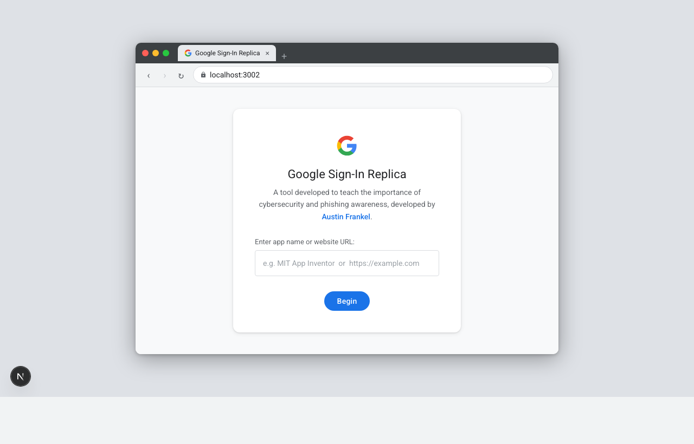
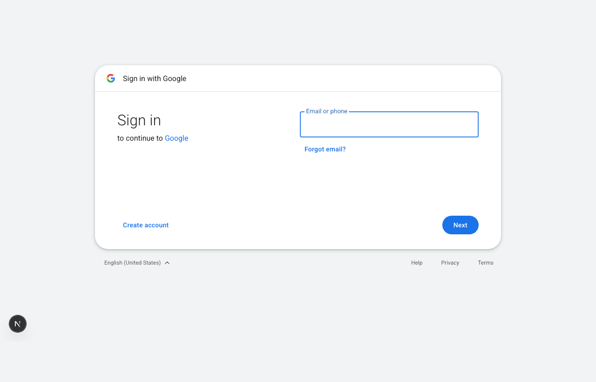

# Google Sign-In Phishing Demo

A cybersecurity education tool that shows how convincing a phishing attack can look.  
Built by [Austin Frankel](https://linkedin.com/in/austin-frankel).





---

## What Is This?

This is a pixel-perfect replica of the Google Sign-In flow built with Next.js. You type in any app name or URL, click **Begin**, and it walks you through the exact same screens Google shows — email entry, password, account creation, passkeys, the whole thing.

The point is simple: **if you can't tell the difference, anyone can be phished.**  
Use this to show friends, classmates, or a class why you should always check the URL bar before you type your password anywhere.

---

## How to Run It Locally

You need Node.js installed. Then:

```bash
git clone https://github.com/AustinFrankel/google-signin-phishing-demo.git
cd google-signin-phishing-demo
npm install
npm run dev
```

Open [http://localhost:3000](http://localhost:3000) and you're good.

---

## How to Use It

1. Type an app name or website URL into the input box (e.g. `canvas.mit.edu` or `Canva`)
2. Click **Begin**
3. Walk through the Google Sign-In flow — it looks real
4. After "signing in", it redirects you to whatever URL you entered
5. Notice how nothing about the UI tells you this was fake — that's the lesson

---

## Tech Stack

- [Next.js 14](https://nextjs.org/) (App Router)
- TypeScript
- CSS Modules
- No external UI libraries — everything is hand-built to match Google's actual design

---

## Important Note

This is **strictly for education**. Do not host this publicly and point real users at it without their knowledge — that would be illegal and unethical. The whole point is to demonstrate the threat in a controlled setting.

---

## Project Structure

```
app/
  page.tsx          ← landing page with the URL input
  fullscreen/       ← the actual sign-in flow route
components/
  steps/            ← each screen in the sign-in flow
  shared/           ← reusable bits (buttons, inputs, logo, etc.)
  GoogleSignInFlow  ← the state machine that drives the whole flow
  GoogleSignInFullscreen ← fullscreen wrapper
```

---

Built with Next.js · Made for learning · Don't be evil
